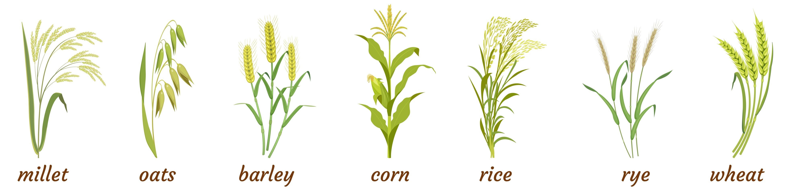

🌾 Rice-Weed Classification using MobileNetV2

  
 
 <b>Deep Learning | MobileNetV2 | Precision Agriculture</b> 

📝 Abstract

This project applies MobileNetV2 with transfer learning for rice-weed classification.
Trained on 3,632 images across 11 classes, the model achieved:

✅ 95.44% Test Accuracy
✅ Stable Generalization
✅ Fast & Efficient Deployment

✨ Features

📊 High Accuracy – 95.44% test accuracy

⚡ Lightweight Model – Runs on mobile/edge devices

⏱️ Quick Training – Leveraging transfer learning

🎯 Confident Predictions – Up to 92.21% confidence on new samples

📊 Dataset & Results
Split	Images
Training	2,901
Validation	358
Test	373
Total	3,632

Performance Metrics:

🏋️ Training Accuracy: 96.07%

🔍 Validation Accuracy: 95.81%

🧪 Test Accuracy: 95.44%

📉 Test Loss: 0.1191

📂 Project Structure
📁 Rice-Weed-Classifier
 ├── train_model.py              # Train the model
 ├── evaluate_model.py           # Evaluate performance
 ├── predict.py                  # Predict new images
 ├── split_dataset.py            # Dataset preparation
 ├── rice_weed_classifier_model.h5 # Trained model
 ├── confusion_matrix_normalized.png
 ├── roc_curves.png
 ├── bar_per_class_accuracy.png
 └── scatter_confidence.png

🚀 Getting Started
🔧 Installation
git clone https://github.com/Devansh-Bansal-AI/Rice-Weed-Classifier
cd Rice-Weed-Classifier
pip install -r requirements.txt

📸 Prediction
python predict.py --image_path path/to/image.jpg

🧪 Evaluation
python evaluate_model.py

📈 Future Work

📱 Real-time mobile deployment

🚁 Drone-based agricultural monitoring

🔍 Object detection for weed localization

🌍 Expanding dataset with regional species

👨‍💻 Author

Devansh Bansal
Student, VIT Bhopal University

 ⭐ If you found this project useful, don’t forget to star the repo! ⭐ 

